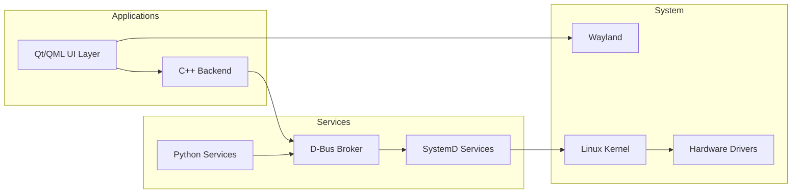
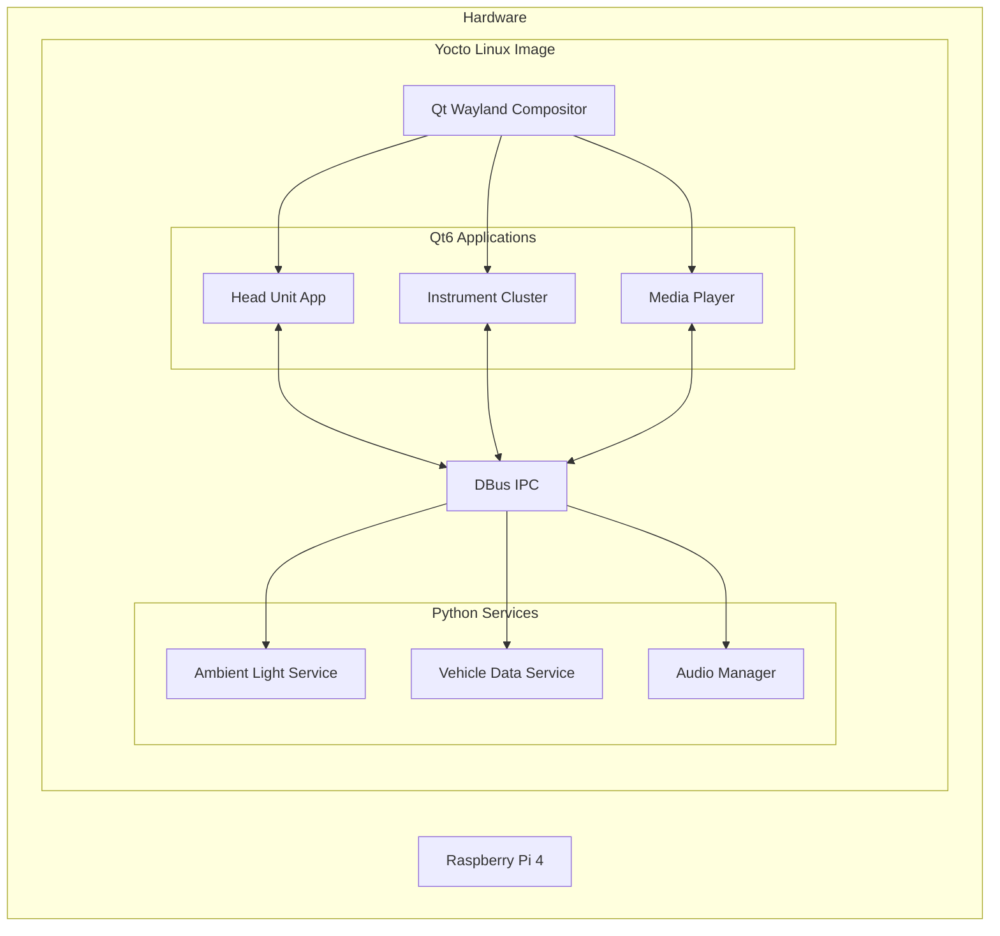
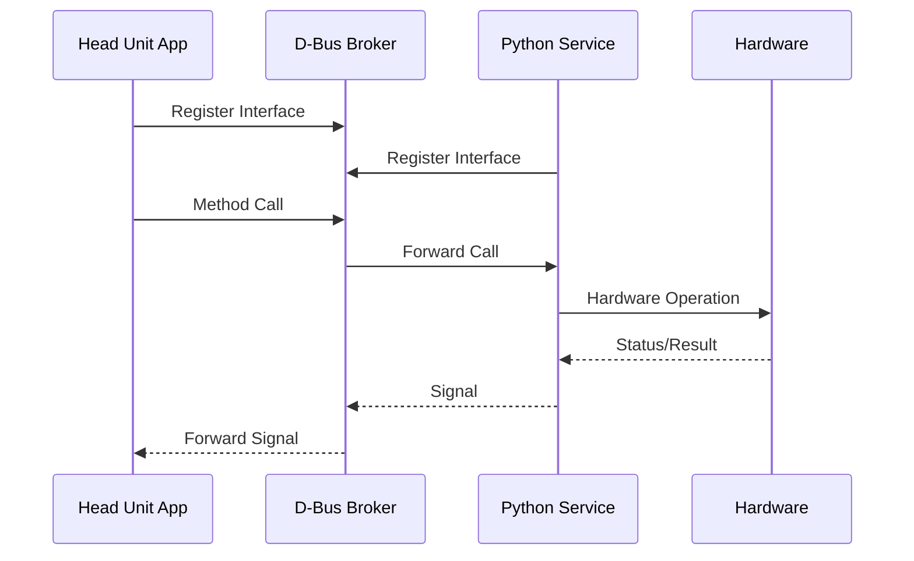

# DES Head-Unit System

A Qt6-based automotive Head Unit system running on Raspberry Pi 4, built with Yocto Linux and following Automotive Grade Linux principles.


## System Overview

The DES Head-Unit is a modern automotive infotainment system that runs on a custom Yocto Linux image for Raspberry Pi 4. The system implements a compositor-based architecture using Qt6 framework for applications and DBus for inter-process communication.

## Technical Architecture

### 1. System Components

- **Yocto Linux Base**
  - Custom-built image for Raspberry Pi 4
  - Optimized for automotive use-case
  - Integration with Automotive Grade Linux components

- **Qt6 Framework**
  - Wayland Compositor
  - QML-based application UI (50.7% of codebase)
  - C++ backend services (28.1% of codebase)

- **Service Layer**
  - Python-based system services (14.8% of codebase)
  - DBus for inter-process communication
  - System monitoring and hardware interfaces


### 2. System Architecture



### 3. Application Structure

The system follows a modular architecture with these key components:

```
project/
├── src/                    # Application source code
│   ├── compositor/         # Wayland compositor
│   ├── apps/              # Qt6 applications
│   │   ├── headunit/      # Main HU application
│   │   ├── media/         # Media player
│   │   └── settings/      # System settings
│   └── services/          # Python system services
├── meta-des-hu/           # Yocto layer
│   ├── conf/
│   └── recipes-*/ 
├── cmake/                 # Build configuration
└── scripts/               # Build and deployment scripts
```

### 4. IPC Architecture

The system uses DBus for inter-process communication:



## Build & Development

### Prerequisites

- Docker (for Yocto builds)
- Qt Creator 6.5+
- Python 3.9+
- CMake 3.21+

### Building the System

1. **Setup Build Environment**
   ```bash
   # Clone repository
   git clone https://github.com/SkySom13/DES_Head-Unit.git
   cd DES_Head-Unit
   ```
2. **Build Applications**
   ```bash
   # Configure CMake
   cmake -B build -S .
   
   # Build all applications
   cmake --build build
   ```

3. **Build Yocto Image**
   ```bash
   # Initialize Yocto environment
   source scripts/init-build-env
   
   # Build using Docker
   ./scripts/build-yocto.sh
   ```


## Testing

The system includes:
- Unit tests for C++ components
- Integration tests for Python services
- End-to-end tests for UI components
- Hardware-in-loop tests for system integration

## Documentation

Detailed documentation is available in the `docs/` directory:
- Architecture Guide
- API References
- Service Specifications
- Build Instructions
- Testing Guidelines

## Contributing

1. Fork the repository
2. Create your feature branch (`git checkout -b feature/AmazingFeature`)
3. Commit your changes (`git commit -m 'Add some AmazingFeature'`)
4. Push to the branch (`git push origin feature/AmazingFeature`)
5. Open a Pull Request

## License

This project is licensed under the MIT License - see the [LICENSE](LICENSE) file for details.
