# HeadUnit IVI System 

---

## 1. System Architecture Overview

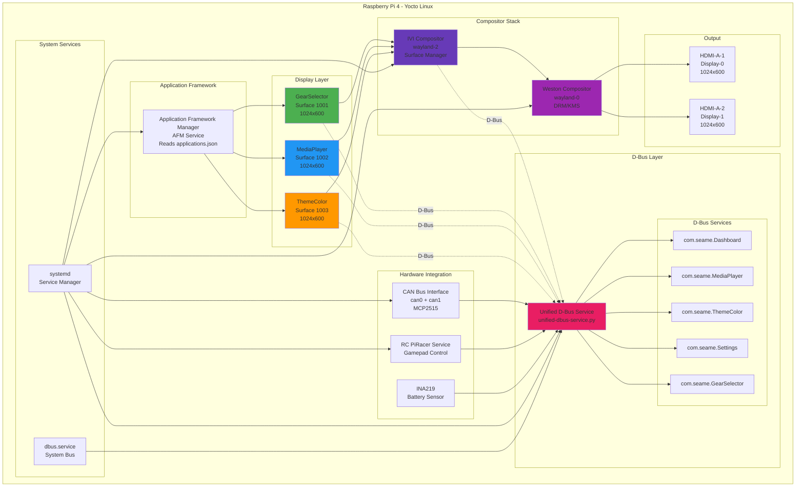

---

## 2. Display Layer Architecture

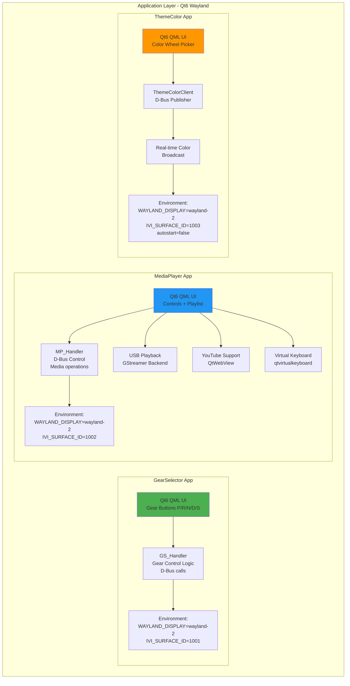

---

## 3. Compositor Stack

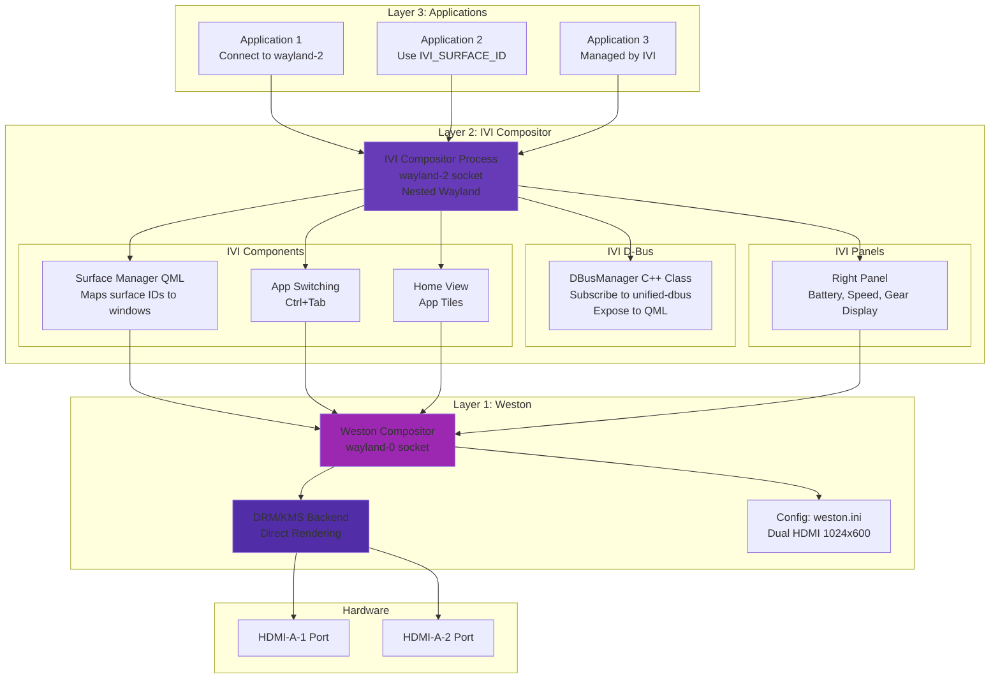

---

## 4. D-Bus Architecture

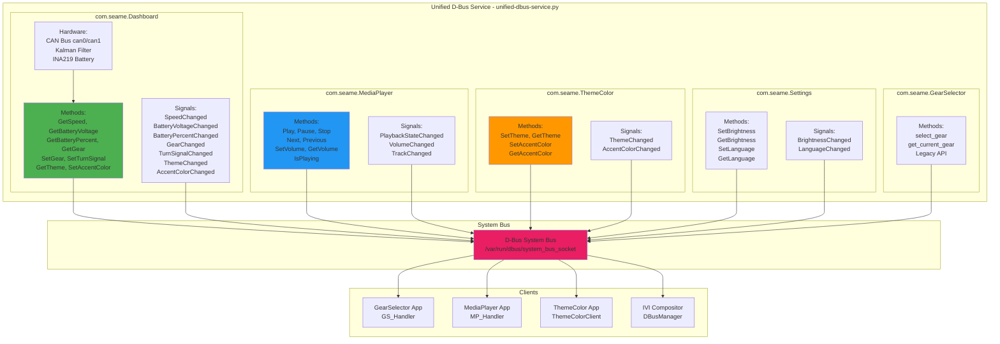

---

## 5. Hardware Integration Flow

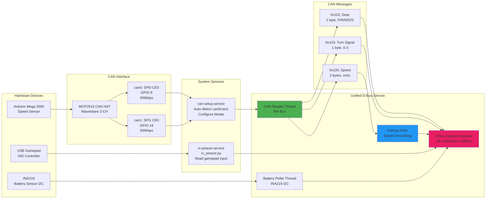

---

## 6. CAN Bus Message Protocol

```mermaid
graph TB
    subgraph "CAN ID: 0x100 - Speed"
        SPEED_DLC[DLC: 2 bytes]
        SPEED_H[Data0: High Byte]
        SPEED_L[Data1: Low Byte]
        SPEED_UNIT[Unit: cm/s Big-Endian]
        SPEED_EX[Example: 0x00 0x64<br/>= 100 cm/s = 1 m/s]
        SPEED_PROC[Processing:<br/>Kalman Filter<br/>→ SpeedChanged signal]
    end

    subgraph "CAN ID: 0x102 - Gear"
        GEAR_DLC[DLC: 1 byte]
        GEAR_ASCII[Data0: ASCII character]
        GEAR_P[P = 0x50: Park]
        GEAR_R[R = 0x52: Reverse]
        GEAR_N[N = 0x4E: Neutral]
        GEAR_D[D = 0x44: Drive]
        GEAR_S[S = 0x53: Sport]
        GEAR_PROC[Processing:<br/>Direct mapping<br/>→ GearChanged signal]
    end

    subgraph "CAN ID: 0x103 - Turn Signal"
        TURN_DLC[DLC: 1 byte]
        TURN_0[0x00: Off]
        TURN_1[0x01: Left]
        TURN_2[0x02: Right]
        TURN_3[0x03: Hazard]
        TURN_PROC[Processing:<br/>Map to string<br/>→ TurnSignalChanged signal]
    end

    SPEED_DLC --> SPEED_H
    SPEED_DLC --> SPEED_L
    SPEED_H --> SPEED_UNIT
    SPEED_L --> SPEED_UNIT
    SPEED_UNIT --> SPEED_EX
    SPEED_EX --> SPEED_PROC

    GEAR_DLC --> GEAR_ASCII
    GEAR_ASCII --> GEAR_P
    GEAR_ASCII --> GEAR_R
    GEAR_ASCII --> GEAR_N
    GEAR_ASCII --> GEAR_D
    GEAR_ASCII --> GEAR_S
    GEAR_P --> GEAR_PROC
    GEAR_R --> GEAR_PROC
    GEAR_N --> GEAR_PROC
    GEAR_D --> GEAR_PROC
    GEAR_S --> GEAR_PROC

    TURN_DLC --> TURN_0
    TURN_DLC --> TURN_1
    TURN_DLC --> TURN_2
    TURN_DLC --> TURN_3
    TURN_0 --> TURN_PROC
    TURN_1 --> TURN_PROC
    TURN_2 --> TURN_PROC
    TURN_3 --> TURN_PROC

    style SPEED_PROC fill:#4CAF50
    style GEAR_PROC fill:#2196F3
    style TURN_PROC fill:#FF9800
```

---

## 7. Kalman Filter Architecture

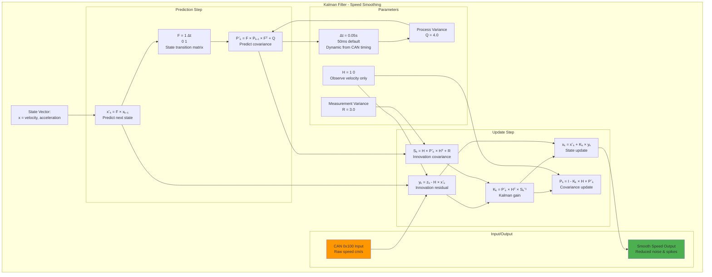

---

## 8. Data Flow - Theme Color Change

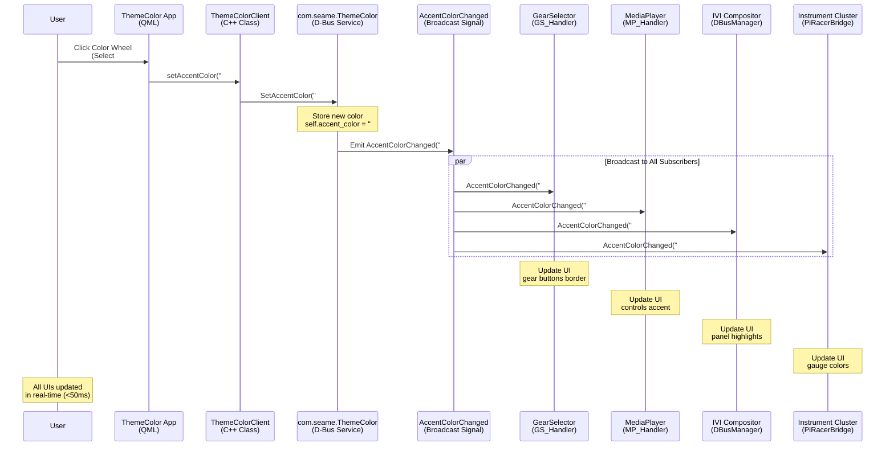

---

## 9. Data Flow - Gear Selection (Gamepad)

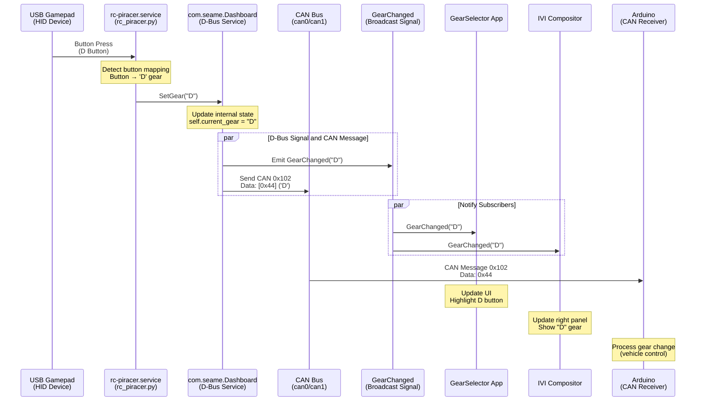

---

## 10. Data Flow - Speed Update (CAN Bus)

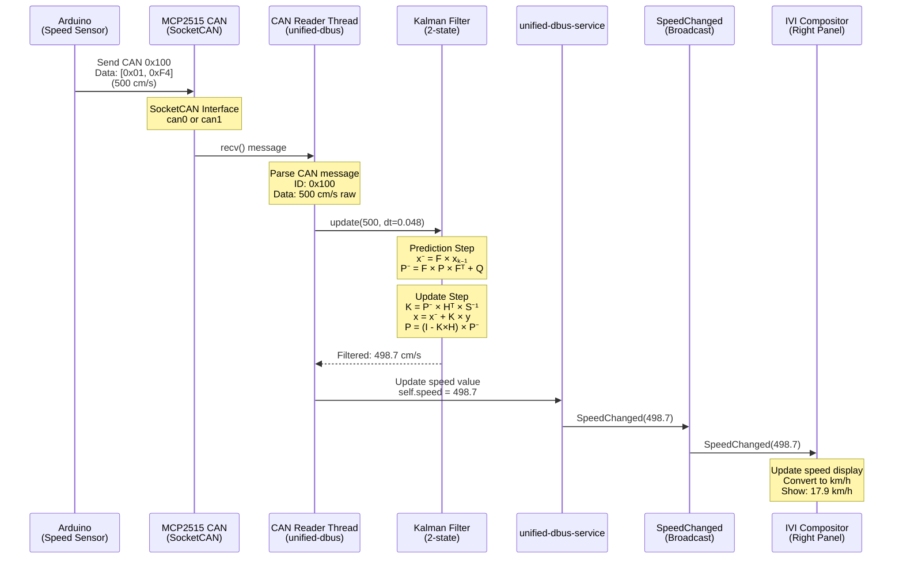

---

## 11. Data Flow - Media Control

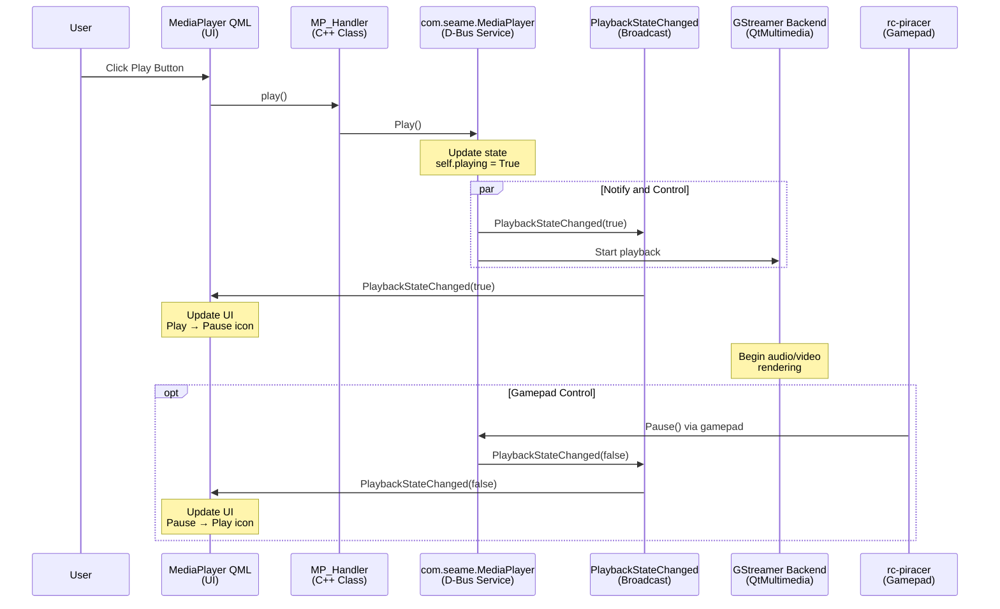

---

## 12. Service Dependencies Graph

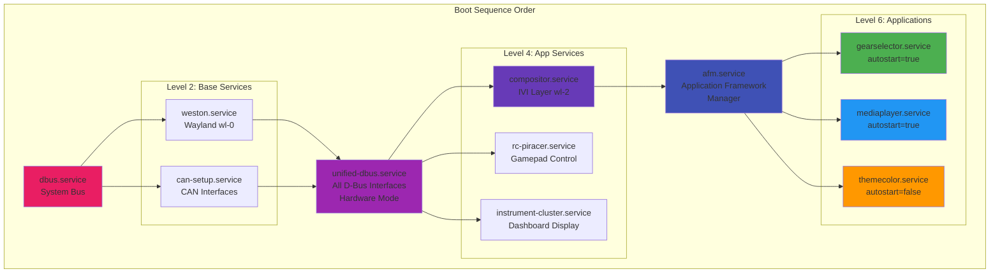

---

## 13. Service Restart Policies

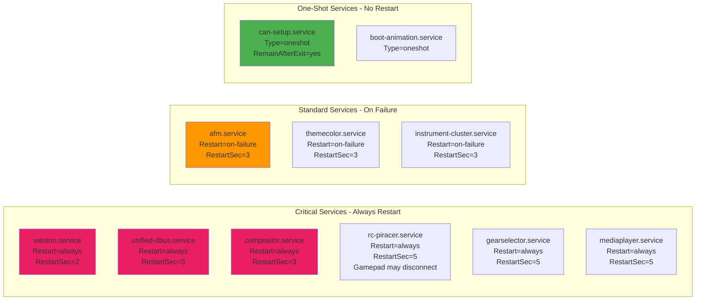

---

## 14. File System Structure

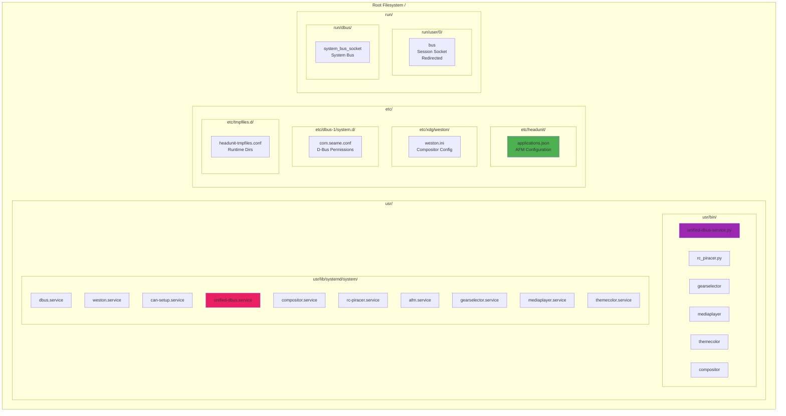

---

## 15. Yocto Build Architecture

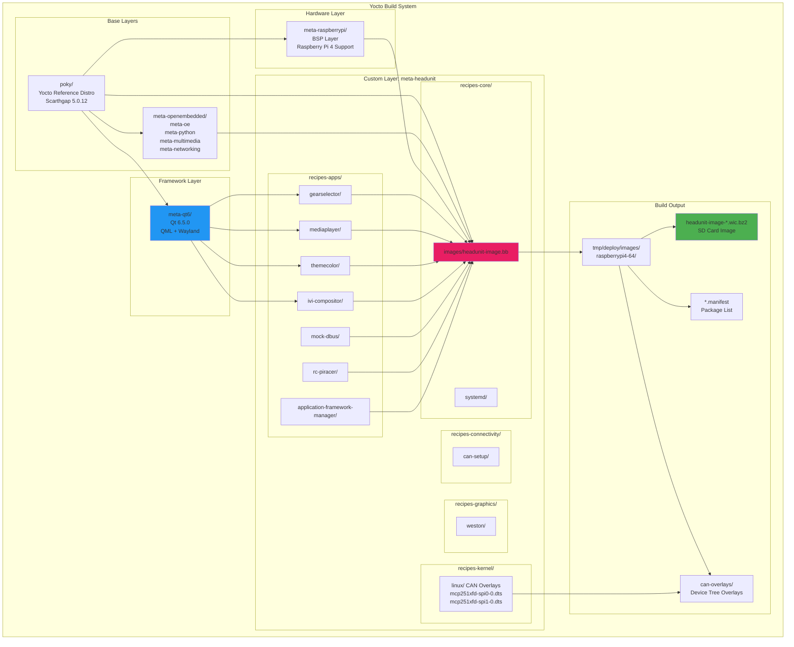

---

## 16. Feature Matrix

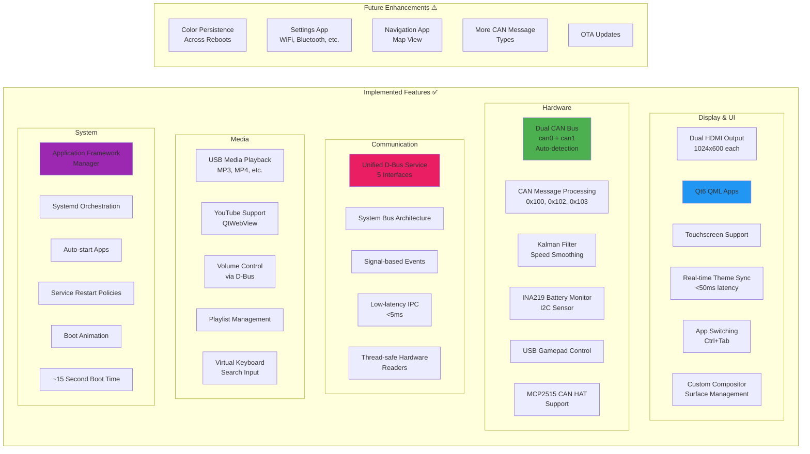

---

## 17. Performance Metrics

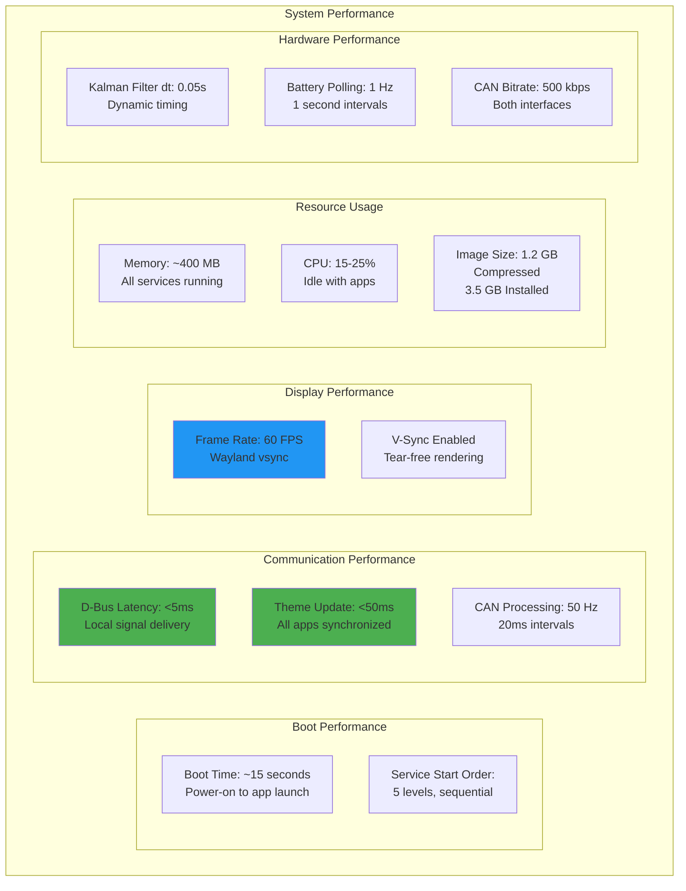

---

## 18. System Statistics Summary

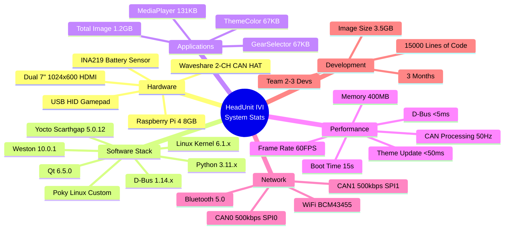

---

**Presentation Date:** Monday, December 9, 2025
**Project:** HeadUnit IVI System - SEAME
**Status:** ✅ Working Image (Previous Stable Version)

---

## Usage Notes:

1. **Copy any diagram** and paste it into:
   - Mermaid Live Editor: https://mermaid.live
   - GitHub README (renders automatically)
   - VS Code (with Mermaid extension)
   - Notion, Confluence, GitLab (native support)

2. **Export options:**
   - PNG/SVG from Mermaid Live
   - PDF via browser print
   - PowerPoint via copy-paste

3. **Customize:**
   - Change colors: `style NodeName fill:#HEX`
   - Adjust layout: `TB` (top-bottom), `LR` (left-right)
   - Add more details as needed
